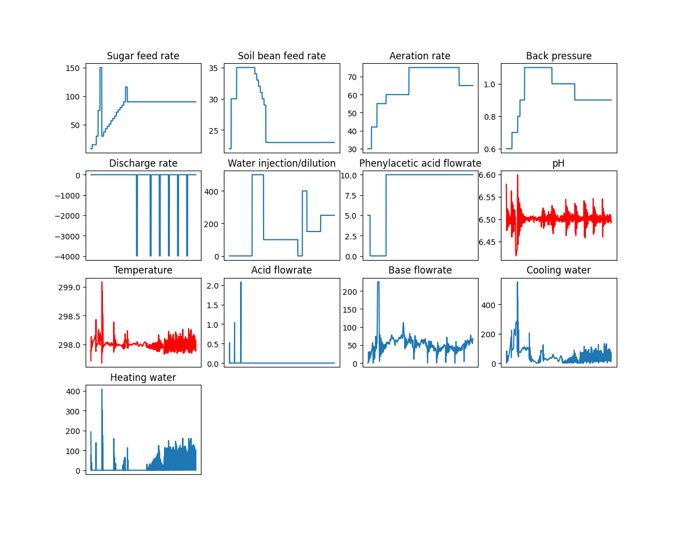
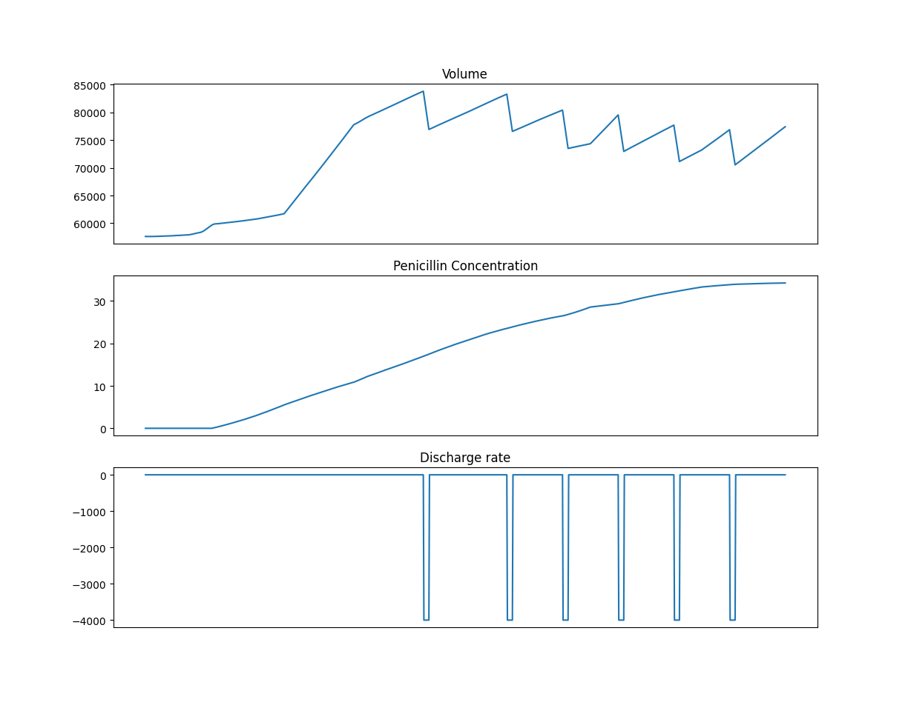

# PenSimPy
Python version of IndPenSim
#### How to use
```
pip install -r requirements.txt
python main.py
```
#### Params in main.py
```
total_runs = 1
num_of_batches = 1
plot_res = True
save_res = True
```
#### Results
Figures for inputs

Figures for outputs

Csv data paths
```
/path/to/PenSimPy/data/0/batch_median_trend.csv
/path/to/PenSimPy/data/0/batch_statistics.csv
```

